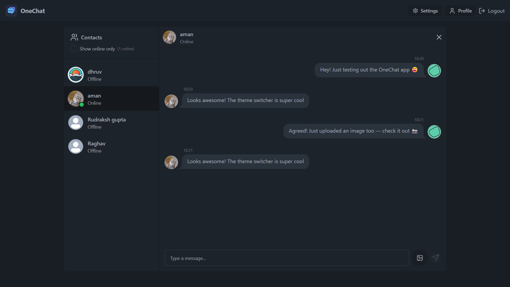
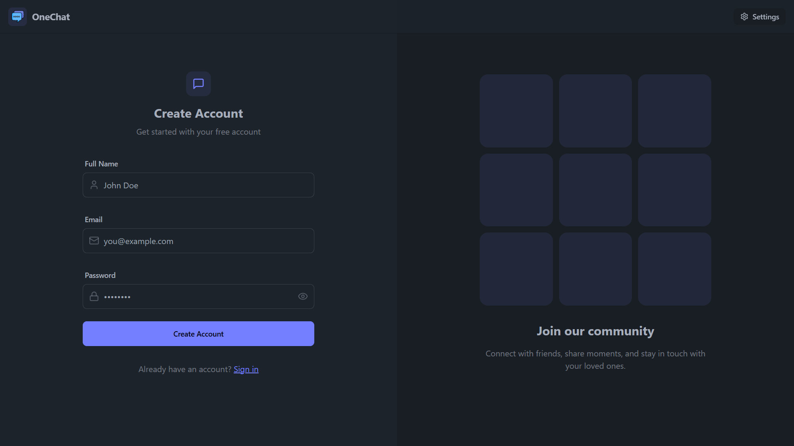
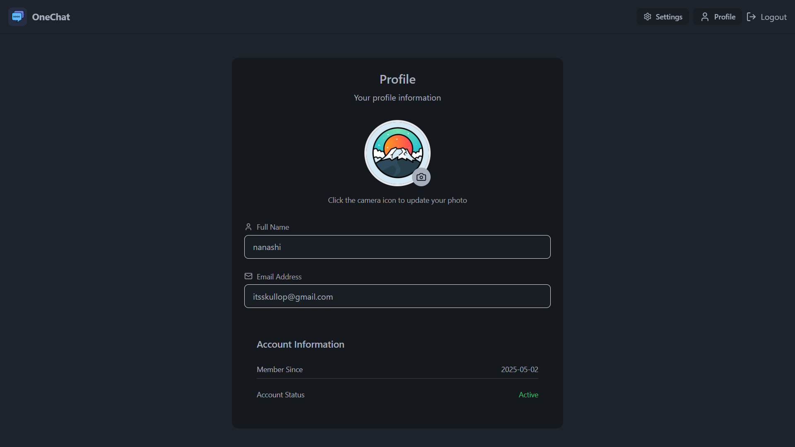
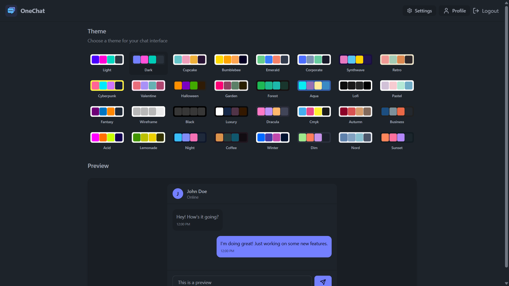

# OneChat

**OneChat** is a one-to-one real-time chatting application built as a learning project to enhance development skills and showcase in a portfolio. It includes private messaging, image sharing, status indicators, and supports 32 beautiful UI themes powered by DaisyUI.



## 🚀 Live Demo

🔗 [https://chat-app-o74y.onrender.com/](https://chat-app-o74y.onrender.com/)

---

## 📸 Screenshots

### 🔐 Login Page



### 💬 Chat Interface


**Chat Preview:**

```
User 1: Hey! Just testing out the OneChat app 😄
User 2: Looks awesome! The theme switcher is super cool 🔥
User 1: Agreed! Just uploaded an image too — check it out 📸
User 2: Got it! Works perfectly 👍
```

### 👤 Profile Page



### 🎨 Theme Switcher



---

## ✨ Features

- 🔐 JWT-based authentication
- 💬 One-to-one real-time messaging
- 🖼️ Image sharing via Cloudinary
- 🟢 Online/Offline status indicators
- 🎨 32 DaisyUI themes
- 📥 Message history using MongoDB
- 🔄 Real-time messaging via polling (no Socket.IO)

---

## 🛠️ Tech Stack

### Frontend

- React.js
- Tailwind CSS
- DaisyUI

### Backend

- Node.js
- Express.js
- MongoDB (Mongoose)
- JWT for auth
- Cloudinary for image storage

---

## 📁 Project Structure

```
chat-app/
├── client/        # React frontend
└── server/        # Node/Express backend
```

---

## 🔧 Setup Instructions

1. **Clone the repository**

   ```bash
   git clone https://github.com/dhruvgupta0107/chat-app.git
   cd chat-app
   ```

2. **Install dependencies**

   ```bash
   # Backend
   cd server
   npm install

   # Frontend
   cd ../client
   npm install
   ```

3. **Create `.env` file in `/server`** with the following variables:

   ```env
   PORT=5000
   MONGO_URI=your_mongodb_uri
   JWT_SECRET=your_jwt_secret
   CLOUDINARY_CLOUD_NAME=your_cloudinary_name
   CLOUDINARY_API_KEY=your_cloudinary_key
   CLOUDINARY_API_SECRET=your_cloudinary_secret
   ```

4. **Run the project**

   ```bash
   # Start backend
   cd server
   npm start

   # Start frontend
   cd ../client
   npm start
   ```

---

## 🧪 Testing the App

- Register or log in.
- Start a private chat.
- Share text and image messages.
- Change UI theme using the built-in DaisyUI options.

---

## 🤝 Contributing

This is a personal learning project, but contributions are welcome!  
Feel free to fork the repo, make changes, and open a pull request.

---

## 📄 License

This project is currently unlicensed. Use freely for educational or reference purposes.

---
